# PickNext

> Fair and fun team picking, without the awkward pause.

[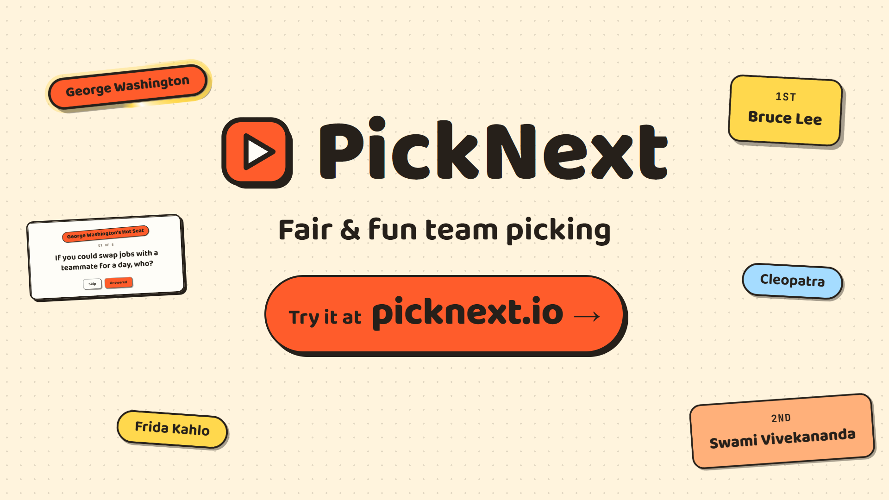](https://youtu.be/xQKuaOJcOG0)

Try it at [picknext.io](https://picknext.io), no install needed, or
[watch the video](https://youtu.be/xQKuaOJcOG0).

Who speaks next at standup? Who wins the raffle? Who answers the icebreaker?
PickNext picks for you, with a suspense roulette, a timer, and a recap at the
end. Four modes: **Standup**, **Raffle**, **Icebreaker**, and **Hot Seat**.

No account needed. Your teams are saved in your browser on this device, and
stay there unless you share one with a link or a file. The hosted site counts
anonymous page views with [Plausible](https://plausible.io) and uses no
cookies.

## How it works

Picks use the browser's crypto RNG. Each person gets one pick per round unless
you allow repeats, and extra chances show on the start screen and on the name
tags.

Tap a name before you start to mark that person out today, and they sit out for
the rest of the day.

The name tags are big enough to read on a shared screen or TV. There is a
presenter mode, keyboard shortcuts, and a light and a dark theme.

The demo crew is 15 of history's legends, so you can try every mode before
typing a single name.

## Get started

[Documentation](./docs/README.md) ·
[Standup](./docs/standup.md) ·
[Raffle](./docs/raffle.md) ·
[Icebreaker](./docs/icebreaker.md) ·
[Hot Seat](./docs/hot-seat.md) ·
[Teams and data](./docs/teams-and-data.md)

## See it in action

### Welcome: pick a mode and a team

The setup card picks the mode and the team: the demo crew (with a rotating
one-liner from the legends) or your own names. **Continue →** opens the Start
screen.

<table>
  <tr>
    <td width="50%" valign="top">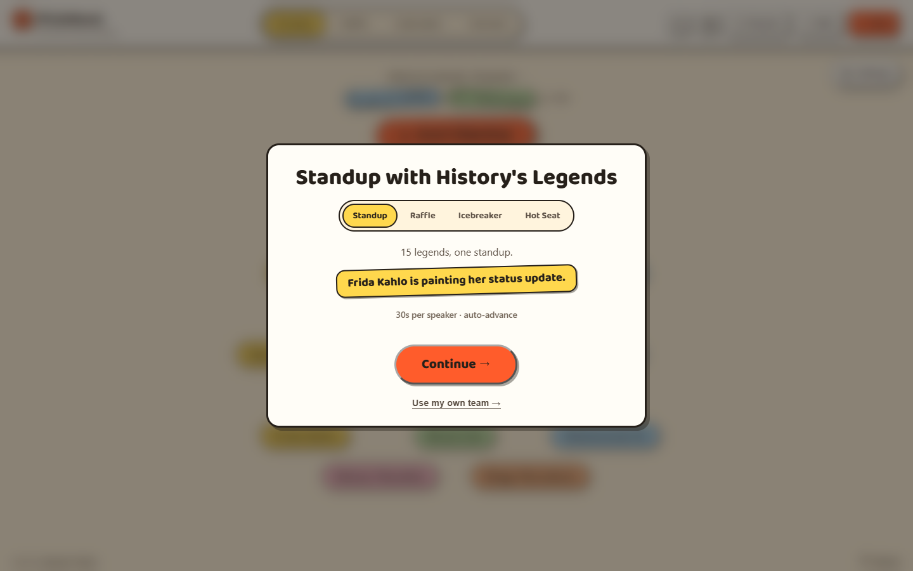</td>
    <td width="50%" valign="top">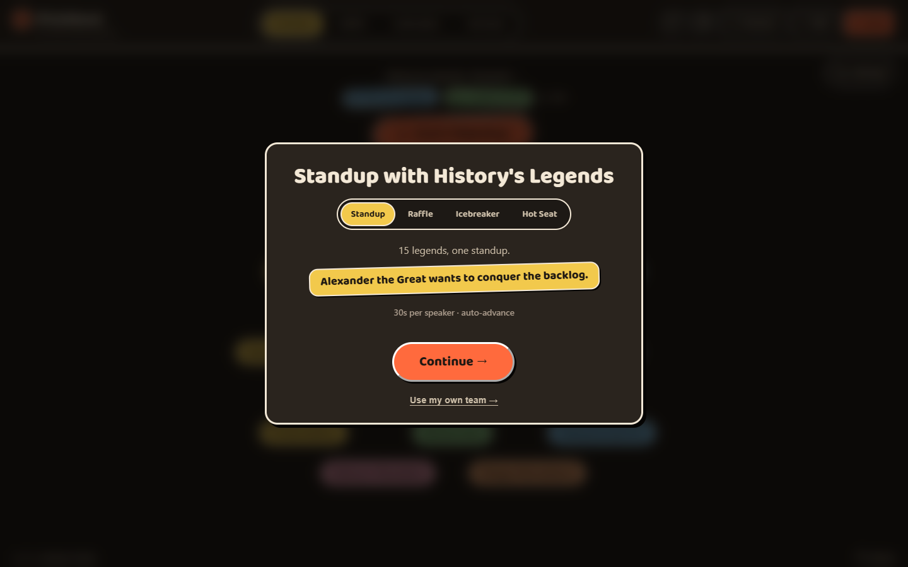</td>
  </tr>
</table>

### Standup: timed turns

The roulette lands on the next speaker and a timer starts. **Skip Speaker**
sends them to the end of the queue, **Pause** stops the clock, and **Pick Next**
moves on. Names already picked fade in the cloud, and **Progress** on the left
lists the order so far.

<table>
  <tr>
    <td width="50%" valign="top">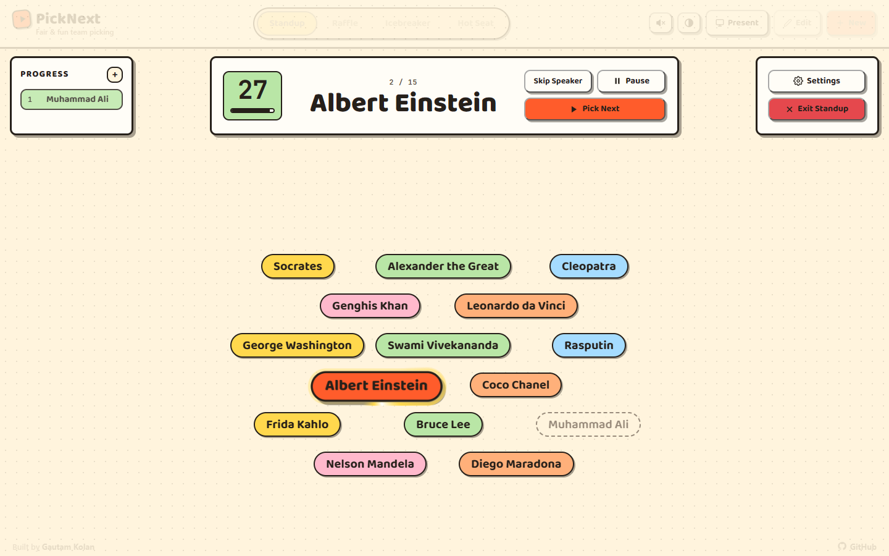</td>
    <td width="50%" valign="top">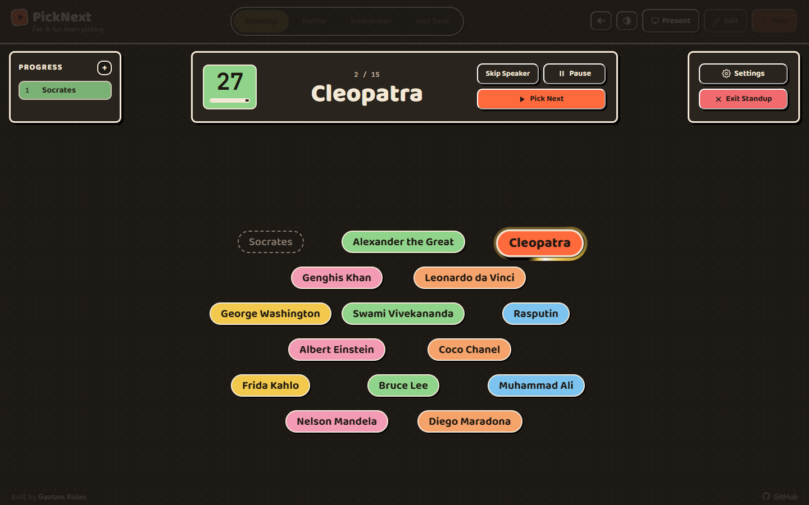</td>
  </tr>
</table>

### Raffle: last place to first

Prizes are drawn from last place up, each with a longer roulette than the one
before. The podium recap shows the winners in place order.

<table>
  <tr>
    <td width="50%" valign="top">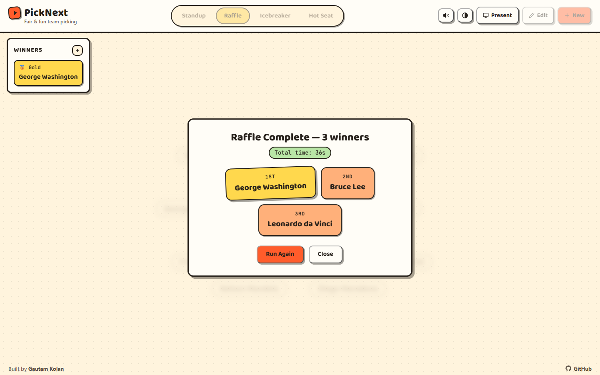</td>
    <td width="50%" valign="top">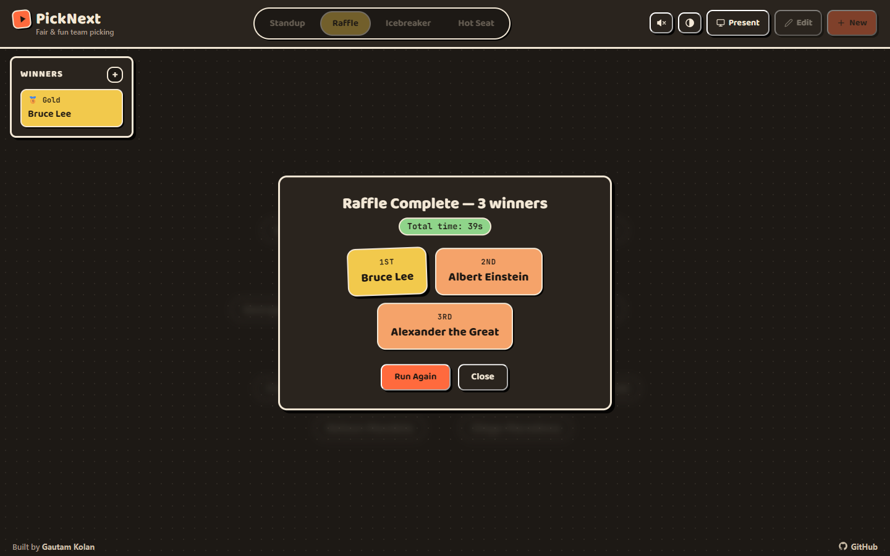</td>
  </tr>
</table>

### Icebreaker: a topic, then a person

A topic is drawn from the topic cloud, then a person to answer it, with a timer
for their turn.

<table>
  <tr>
    <td width="50%" valign="top">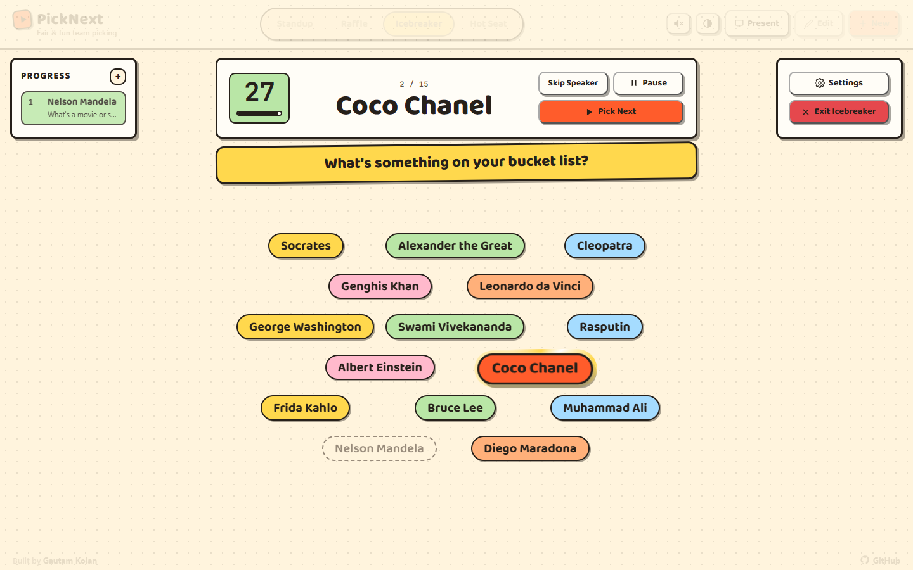</td>
    <td width="50%" valign="top">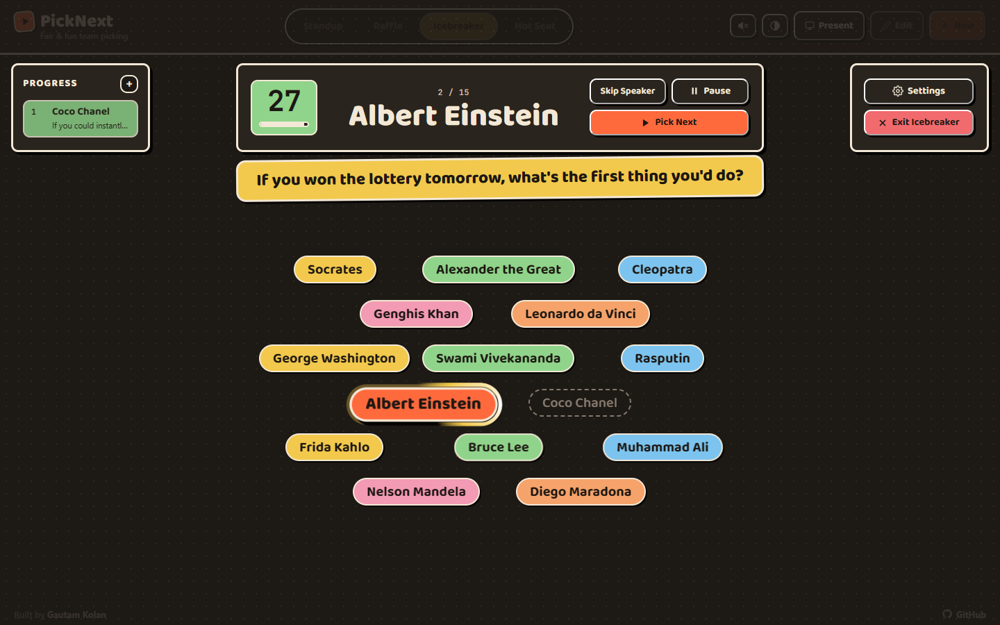</td>
  </tr>
</table>

### Hot Seat: rapid-fire questions

One person takes the seat and answers a round of timed questions. **Answered**
or **Skip** moves to the next one. When the timer runs out, the next question
starts on its own.

<table>
  <tr>
    <td width="50%" valign="top">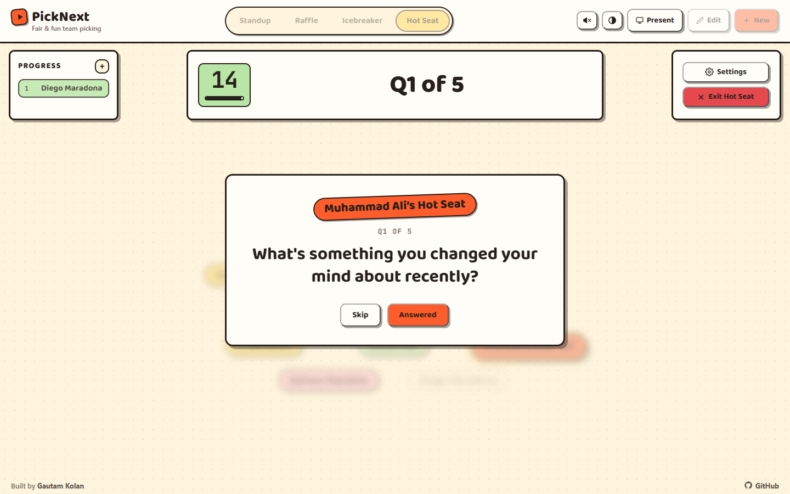</td>
    <td width="50%" valign="top">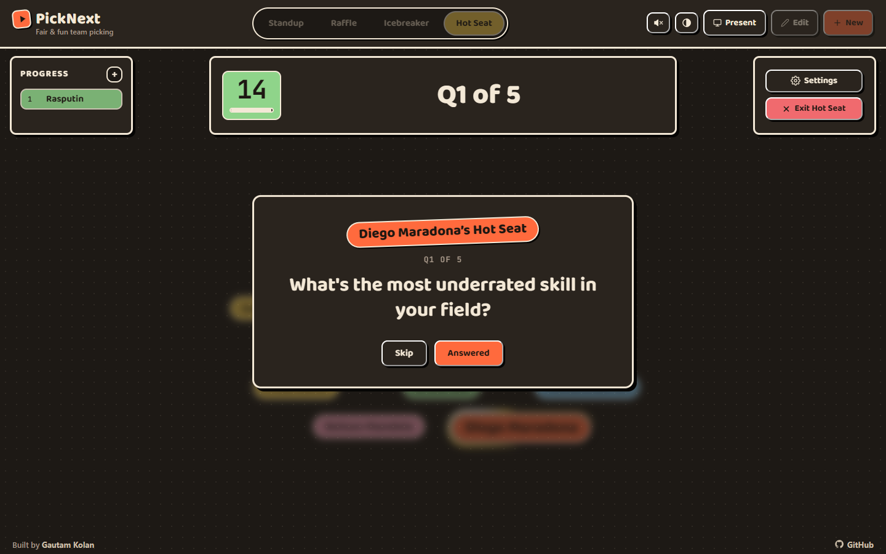</td>
  </tr>
</table>

## Try it in two minutes

You need Node `>=20` and npm. The app runs as is, with no API keys or
environment variables to set up.

```bash
npm ci
```

```bash
npm run dev
```

Open [localhost:5173](http://localhost:5173) and choose a format. The demo crew
is ready to go.

## What it does

| Feature | In short |
| --- | --- |
| [Standup](docs/standup.md) | Next speaker by roulette, per-speaker timer with auto-advance or overtime, skip to the end of the queue, recap with time used. |
| [Raffle](docs/raffle.md) | Draws N prizes from last place to 1st with escalating suspense, podium recap. |
| [Icebreaker](docs/icebreaker.md) | Topic from an editable topic list, then a person to answer it. Optional repeats. |
| [Hot Seat](docs/hot-seat.md) | A person, then a round of timed questions from an editable question list. |
| [Teams and data](docs/teams-and-data.md) | Multiple teams, out today, raffle chances, per-person timers, share a team link, export and import JSON. |
| [Presenting](docs/presenting.md) | Presenter mode, keyboard shortcuts, sound, light / dark / system theme, phone and TV layouts. |

## Your data

PickNext saves teams, topics and questions in your browser on this device. Each browser, device, and private
window keeps its own data, and clearing site data resets the app. Use
**Export** in Settings to keep a backup as a plain JSON file you can import
anywhere.

<details>
<summary><strong>For developers</strong></summary>

<br />

The app is vanilla JavaScript (ES modules, no framework), built with
[Vite](https://vite.dev), animated with [GSAP](https://gsap.com), tested with
Vitest, and linted with ESLint.

```
index.html        markup; loads js/main.js as an ES module
styles.css        the whole design system (tokens at the top, light + dark)
js/               app modules (see docs/ARCHITECTURE.md)
tests/            Vitest unit tests and jsdom session/DOM regressions
public/           static files copied as-is (icons, manifest, OG image, robots, sitemap)
docs/             user guides, architecture, testing, screenshots
```

`updateUI()` in `js/render.js` is the single place that maps state to what is
visible. Pure logic lives in DOM-free modules with a test in `tests/`. See
[docs/ARCHITECTURE.md](docs/ARCHITECTURE.md).

| Command | Purpose |
| --- | --- |
| `npm run dev` | Vite dev server on port 5173 |
| `npm run build` / `npm run preview` | Production build to `dist/` / serve it locally |
| `npm run lint` | ESLint |
| `npm test` | All Vitest suites |
| `npm run check` | Lint + test + build (run before committing) |

</details>

## Contributing

See [CONTRIBUTING.md](CONTRIBUTING.md) for local checks, testing requirements,
and pull request guidance.

## Questions and feedback

To report a bug or ask a question, see [SUPPORT.md](SUPPORT.md) and the issue
forms. For a security concern, see [SECURITY.md](SECURITY.md). User-visible
changes are in [CHANGELOG.md](CHANGELOG.md).

## Copyright

Copyright © 2026 Gautam Kolan. All rights reserved.

The source is here to read, so you can see how PickNext works and how it looks
after your data. Use it anytime at [picknext.io](https://picknext.io).
